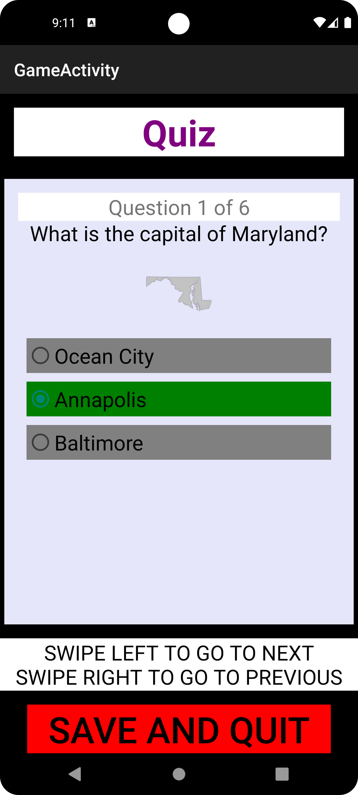

# CSCI 4060: Mobile App Development

## Project 4: State Capitals Quiz

## IN PROGRESS

### Team Members:

- John Lavender:
    - Designed the backend, database, and interfaces
    - Wrote unit tests
- Edis Makelja:
    - Designed the frontend and xml
    - Wrote async tasks to ensure the app runs smoothly

### Project Description:

This project is a quiz app that tests the user's knowledge of the states in the
United States. The user is presented with quizzes of six questions each. The user is given a score
based on the number of correct answers in the end. The results of finished quizzes are saved and can
be viewed in the view scores page. Also, the user can pause a quiz and continue it at a later point.

### The Game:

Currently, there is only one quiz type supported: Capitals Quiz. This type of quiz tests the user's
knowledge of the capital city of each state. The app is designed in such a way so that more quiz
types
can be easily implemented.

### Walkthrough:

When the app is loaded, the user is presented with the main menu. From here, the user can start a
new quiz, continue a previous incomplete quiz, or view the scores of completed quizzes.

When the user starts a new quiz, they are presented with a quiz type selection screen. Currently,
there is only one quiz type supported: Capitals Quiz. This type of quiz tests the user's knowledge
of the capital city of each state. The app is designed in such a way so that more quiz types can be
easily implemented.

After the user selects a quiz type, they are presented with the quiz. The quiz consists of six
questions. Each question is a multiple choice question with four possible answers. The user can
select an answer by clicking on the corresponding button. The user can also pause the quiz at any
time by clicking the pause button. The user can also go back to the main menu by clicking the
"Save and Quit" button.

After the user answers all six questions, they can submit the quiz. This finalizes the quiz and
presents the score.

If the user instead pressed "Save and Quit", then the user can continue the quiz from the quiz
selection menu.

The user can also view the scores of completed quizzes from the main menu.

